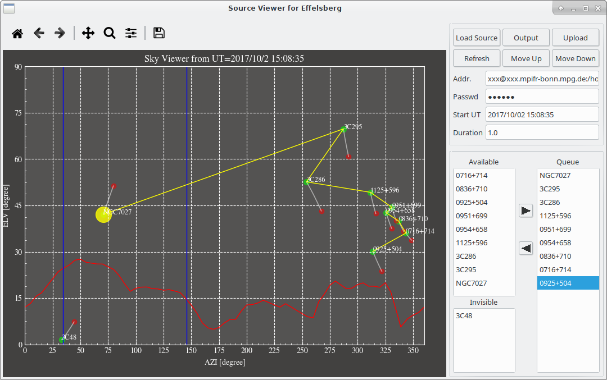

# SourceViewer
SourceViewer is an application for optimizing the observation strategy by checking the sky coverage for a given sample.

## how to use it

simply run `python SourceView.py`

## the GUI

The GUI of the application in a typical Linux environment is showing bellow.

### the sky coverage plot

- `blue vertical lines`: the slewing limits of the antenna in azimuth
- `red line`: the horizon of the mountains (or more precisely, the elevation below which the signal strength decreases by 10dB due to shielding by the mountains/trees)
- `green points`: the position of the loaded sources at starting UT
- `red points`: the position of the loaded sources at ending UT
- `yellow line`: the oberving sequence of the sources in the queue, `big yellow point` indicates the starting source. The expected total obereving time for this sequence is shown in the terminal. 

### the button and setup panels

see [`settings`](#settings) and [`operations`](#operations) bellow

### the source lister

- `Available`: list of the sources above the horizon of the mountains

- `Invisible`: list of the sources below the horizon of the mountains
- `Queue`: list of the sources that are to be observed

## settings

- `Addr.`: the remote address that the observation script will be uploaded to. The input format should be `username@ipaddress:directory`
- `Passwd`: the `SSH` password for the remote computer
- `Start UT`: the starting observation time in UT, by default it is the computer time when the application is opened
- `Duration`: the duration of the observation in hour

## operations

- `Load Source`: open a dialog to choose a catalog that contains the observation sample
- `Output`: save the sources listed in the queue to an observation script, which is by default named `tmp.run`
- `Upload`: upload the observation script to a remote controling computer
- `Refresh`: refresh the sky coverage plot
- `Move Up`: move up the selected source(s) in the queue
- `Move Down`: move down the selected source(s) in the queue
- `Right Arrow`: move the available source(s) into the queue
- `Left Arrow`: move the selected source(s) out from the queue